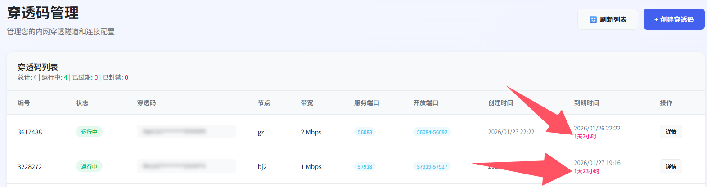
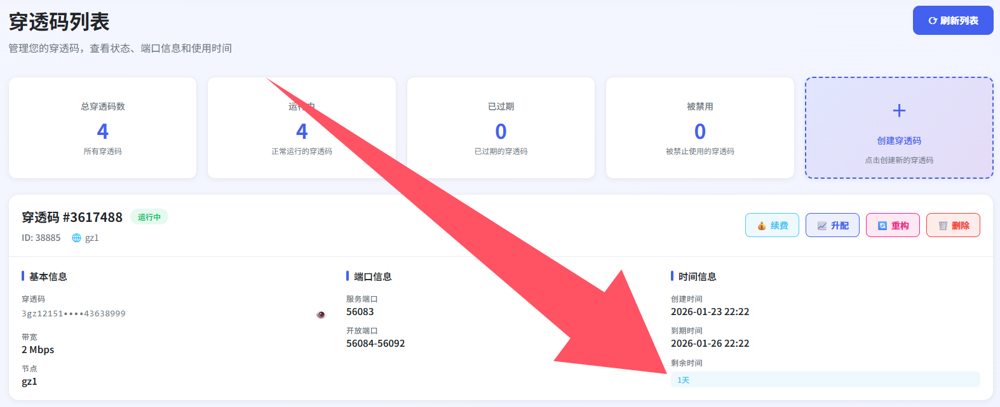
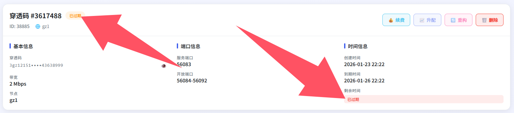
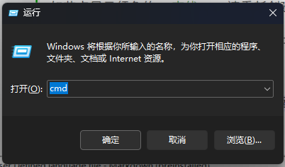
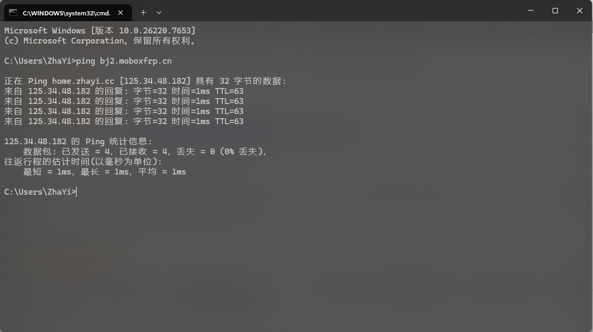
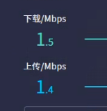
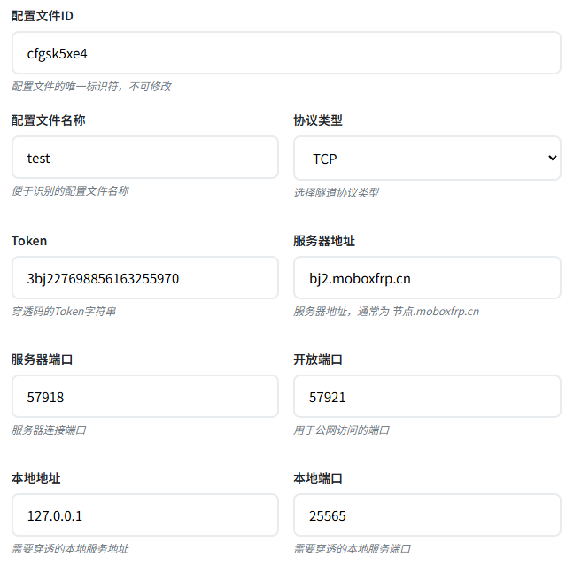
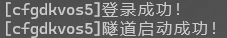
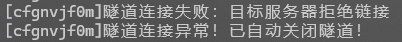

# 起飞（联机）前检查单

在开始联机之前，请务必对着这张单子过一遍，能解决 90% 的“为什么我连不上”的问题

## 穿透码状态

### 是否在有效期内

打开你的浏览器， **在本地GUI客户端已经运行的情况下** 地址栏输入 [http://127.0.0.1:11451](http://127.0.0.1:11451/) 访问网页




或者打开 [https://www.moboxfrp.top/services/codes/](https://www.moboxfrp.top/services/codes) 



检查这里的 `到期时间` 和运行状态

如果显示 `已过期`，请立即创建新的穿透码或者续费穿透码



### 带宽是否充足

如果你要进行mc等游戏的联机，请保证你的带宽至少在 `3mbps` 及其以上，否则大概率会出现 `无法连接到服务器` 或者进入游戏后一直坠落的情况

详细可参见[带宽怎么选择合适？](node.md?id=带宽怎么选择合适？)

## 节点状态

### 节点是否在线

请访问 [https://www.moboxfrp.top/services/status](https://www.moboxfrp.top/services/status) 观察你所选择的节点卡片右上角是否出现 `在线`

如节点显示红色的 `离线` ，请重新创建其他节点的穿透码，该节点可能处于维护状态


### 你是否可以正常访问到节点

按住键盘上的 `Win` 和 `R` 键打开运行框，在这里面输入 `cmd` 打开一个黑色的窗口



在这个窗口里面输入 

```
ping <节点编号>.moboxfrp.cn
```

!> 不要把上面的尖括号也给打进去，例如你的穿透码是 `bj2` 节点的，那你就要输入 `ping bj2.moboxfrp.cn` ，而不是 `ping <bj2>.moboxfrp.cn`

观察是否能够出现延迟（见下图）



如果出现了例如 `拒绝访问` 、 `连接超时` 等字样，请检查你的网络，这不一定是MoBoxFrp节点的问题

## 本地相关

### 检查你的网速

#### 打开测速网站[speedtest.cn](https://speedtest.cn)或[speedtest.net](https://speedtest.net)进行网速测试
!> speedtest.net可能因为各种原因无法打开，可尝试.cn

#### 获取到自己的下载(Download)及上传(Upload)后与穿透码大小进行对比(注意单位)

  - 如果测试出来的两个数字均小于你所设置的穿透码带宽大小，你可能需要**检查你的网络**，根据木桶效应的理论，那么即使你开了一个114514Mbps穿透码也毫无用处，速度也只是你测试出来的那一点点，就像这样：
    
	

  - 如果测试出来的两个数字均大于你所设置的穿透码带宽大小，请继续向下执行

#### 如果你使用的是校园网或者家庭普通宽带，高峰期可能会出现上传速度不稳定的问题，请放心这不是仅仅是你一个人的问题（


### 隧道配置是否正确

请在 [http://127.0.0.1:11451/](http://127.0.0.1:11451/) 里检查你的隧道配置文件：

  - 协议类型：mc java版联机请认准 `TCP` 协议，除非你玩的是基岩版或者穿透其他业务
  - Token：你的对应的穿透码，如果你之前使用过 `重构穿透码` 功能，请更新这里的穿透码，或者删除这个配置文件重新选择创建，详见[创建隧道配置](client.md?id=创建隧道配置)
  - 本地地址：如果你是在本机开服，一定要填 `127.0.0.1` ，千万别写错了（默认就是 `127.0.0.1` ，不修改即可）
  - 本地端口：请检查你的本地服务端口是否和这里已经填写的相同，例如你的mc java版服务器目录 `server.properties` 文件里 `server-port=25565`，这里就写25565



### 本地服务端是否开启

请检查你的本地服务端是否开启且运行在正确的端口上

### 隧道是否成功开启

在网页GUI中点击启动隧道之后，请检查黑框里面是否出现了 `隧道启动成功` 的字样



如果显示 `隧道连接失败：目标服务器拒绝链接` 、 `隧道连接异常！已自动关闭隧道！` 等错误字样，请检查以上提到的所有内容



## 如何求助

如果您真的按照我写的一步一步十分有耐心的做完了以上所有，但是仍然无法连接的话，请你携带以下内容到MoBoxFrp QQ群内友好提问：
  
  - 穿透日志截图（如果你的截图中出现了穿透码，请将其覆盖马赛克后再发出，避免穿透码泄露）
  - 详细报错日志（例如mc客户端中连接到服务器后出现的英文）
  - mc服务器日志截图（可选）


