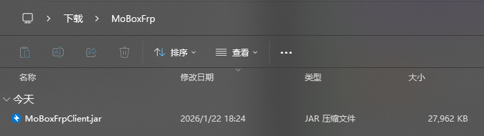
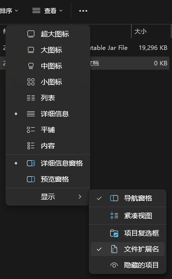
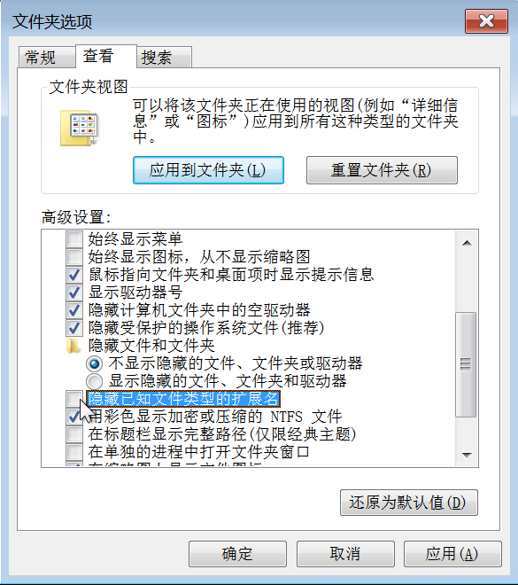
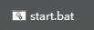
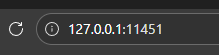

## 环境配置

[MoBoxFrpClient Github Releases](https://github.com/MossCG/MoBoxFrpClient/releases/tag/V1.1.2.1.1935)

> 使用前请务必确保你的电脑上安装了 `java8` 或及以上的版本

### 检查java版本

使用**已经连接在电脑上的键盘**按下 `Win` 键 + `R` 键输入 `cmd` 并按下回车，在弹出的黑框里面输入：

```shell
java -version
```

如果响应是

```shell
java version "22.0.2" 2024-07-16
Java(TM) SE Runtime Environment (build 22.0.2+9-70)
Java HotSpot(TM) 64-Bit Server VM (build 22.0.2+9-70, mixed mode, sharing)
```

或者

```shell
java version "1.8.0_401"
Java(TM) SE Runtime Environment (build 1.8.0_401-b10)
Java HotSpot(TM) 64-Bit Server VM (build 25.401-b10, mixed mode)
```

恭喜你电脑已经安装了正确版本的java，可以进行下一步了

如果响应是

```shell
'java' 不是内部或外部命令，也不是可运行的程序或批处理文件。
```

那么你需要先安装 `Java` 才可以使用GUI客户端

你可以使用 [ZuluJDK](https://www.azul.com/downloads/?version=java-8-lts&os=windows&architecture=x86-64-bit&package=jdk) 或者 [Oracle Java](https://www.java.com/zh-CN/download/) 

安装完成后可以使用MoBoxFrpClient（记得在安装页面勾选Java-Home）

### 启动配置

建议创建一个新的文件夹把刚才下载的 `MoBoxFrpClient.jar` 放进去



双击jar文件大概率会在这个文件夹生成一个 `start.bat` 文件，如果没有也不用担心，可以在这个文件夹里新建一个文本文档，把后缀改成 `.bat` 填写这些东西：

```shell
@echo off
java -Xmx128m -server -jar MoBoxFrpClient.jar
pause
```

如果你没有看见 `MoBoxFrpClient` 后面的 `.jar` 

##### Windows11下勾选 `查看` → `显示` 中的 `文件扩展名` 



##### Windows10下勾选 `查看` 中的 `文件扩展名` 

（图先欠着）

##### Windows7下相对复杂

在 `文件资源管理器` 左上角的 `组织` 中打开 `文件夹和搜索选项` ，在弹出的窗口内点击 `查看` 选项卡，往下滑取消勾选 `隐藏已知文件类型的扩展名` 



请确保这么一通操作下来图标长这样（小齿轮）：



## 启动GUI客户端

双击刚才创建的 `start.bat` 启动 `MoBoxFrpClient` 会弹出来一个黑色的运行框，等待出现 `启动完成！耗时：114毫秒！` 的时候代表启动成功


如果你是Windows11系统，可以通过按住键盘上的 `Ctrl` 键和 `鼠标左键` 点击 `http://127.0.0.1:11451/` 自动打开默认浏览器



也可以打开浏览器在地址栏输入 `http://127.0.0.1:11451/` 访问ui
 


