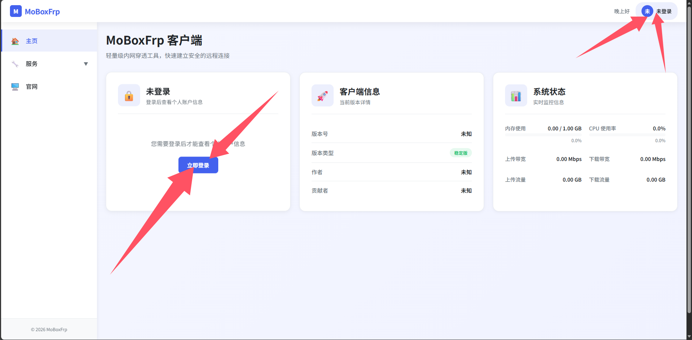
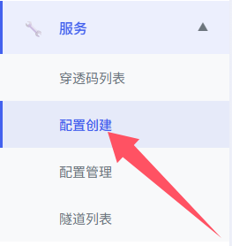
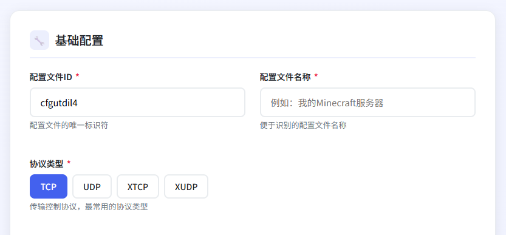
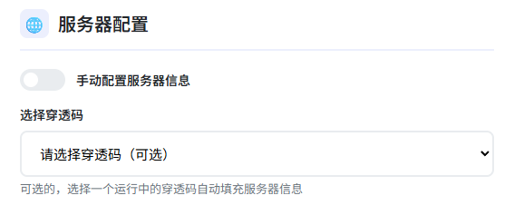
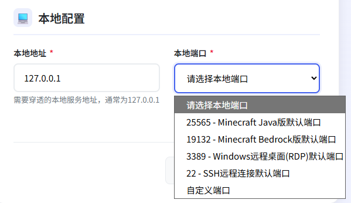
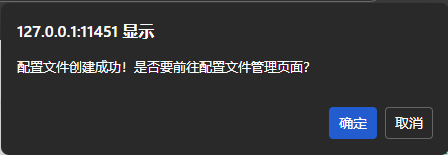
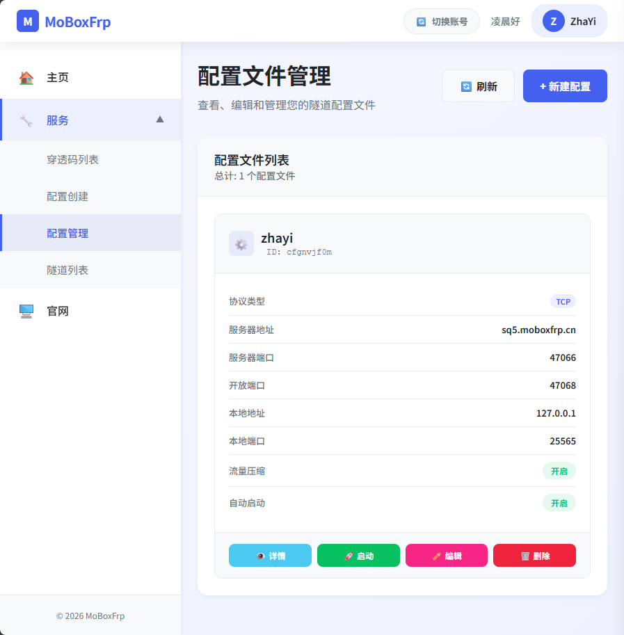
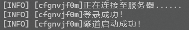
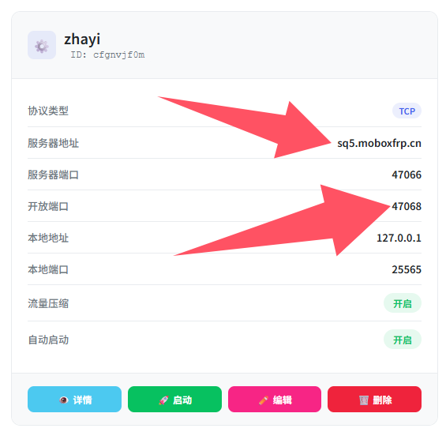

## 环境配置

客户端下载地址：[MoBoxFrpClient Github Releases](https://github.com/MossCG/MoBoxFrpClient/releases/tag/V1.1.2.1.1935)

> 使用前请务必确保你的电脑上安装了 `java8` 或及以上的版本

### 检查java版本

使用**已经连接在电脑上的键盘**按下 `Win` 键 + `R` 键输入 `cmd` 并按下回车，在弹出的黑框里面输入：

```shell
java -version
```

如果响应是

```shell
java version "22.0.2" 2024-07-16
Java(TM) SE Runtime Environment (build 22.0.2+9-70)
Java HotSpot(TM) 64-Bit Server VM (build 22.0.2+9-70, mixed mode, sharing)
```

或者

```shell
java version "1.8.0_401"
Java(TM) SE Runtime Environment (build 1.8.0_401-b10)
Java HotSpot(TM) 64-Bit Server VM (build 25.401-b10, mixed mode)
```

恭喜你电脑已经安装了正确版本的java，可以进行下一步了

如果响应是

```shell
'java' 不是内部或外部命令，也不是可运行的程序或批处理文件。
```

那么你需要先安装 `Java` 才可以使用GUI客户端

你可以使用 [ZuluJDK](https://www.azul.com/downloads/?version=java-8-lts&os=windows&architecture=x86-64-bit&package=jdk) 或者 [Oracle Java](https://www.java.com/zh-CN/download/) 

安装完成后可以使用MoBoxFrpClient（记得在安装页面勾选Java-Home）

### 启动配置

建议创建一个新的文件夹把刚才下载的 `MoBoxFrpClient.jar` 放进去


双击jar文件大概率会在这个文件夹生成一个 `start.bat` 文件，如果没有也不用担心，可以在这个文件夹里新建一个文本文档，把后缀改成 `.bat` 填写这些东西：

```shell
@echo off
java -Xmx128m -server -jar MoBoxFrpClient.jar
pause
```

如果你没有看见 `MoBoxFrpClient` 后面的 `.jar` 

##### Windows11下勾选 `查看` → `显示` 中的 `文件扩展名` 


##### Windows10下勾选 `查看` 中的 `文件扩展名` 

（图先欠着）

##### Windows7下相对复杂

在 `文件资源管理器` 左上角的 `组织` 中打开 `文件夹和搜索选项` ，在弹出的窗口内点击 `查看` 选项卡，往下滑取消勾选 `隐藏已知文件类型的扩展名` 


请确保这么一通操作下来图标长这样（小齿轮）：


## 启动并登录GUI客户端

双击刚才创建的 `start.bat` 启动 `MoBoxFrpClient` 会弹出来一个黑色的运行框，等待出现 `启动完成！耗时：114毫秒！` 的时候代表启动成功


如果你是Windows11系统，可以通过按住键盘上的 `Ctrl` 键和 `鼠标左键` 点击 `http://127.0.0.1:11451/` 自动打开默认浏览器


也可以打开浏览器在地址栏输入 `http://127.0.0.1:11451/` 访问ui

!> 千万不要关闭这个黑色的运行窗口，如果不小心关闭请再次打开，否则将无法访问ui



点击这两个地方都可以登录，手机号/邮箱/密码与 `www.moboxfrp.top` 一致

## 创建隧道配置

!> 请回到**浏览器地址栏是http://127.0.0.1:11451**的网页中进行接下来的操作

> 在此之前请确保你已经完成了[穿透码的创建](code.md?id=创建穿透码)



在左侧的侧边栏中找到 `配置创建`

#### 基础配置



  - `配置文件ID` ：随机生成，保持默认即可，具有唯一性
  - `配置文件名称` ：给自己方便看的，写什么都可以，不具有唯一性
  - `协议类型` ：
    - TCP ：最常用的协议，如果你不清楚你的服务应该用什么协议优先选择这个，例如mc java版服务器
	- UDP ：用户数据报协议，适用于实时应用，例如远程桌面等
	- XTCP ：点对点穿透协议，需要双方都安装frp
	- XUDP ：点对点UDP协议

#### 服务器配置



> 如果你不是很懂的话请不要开启 `手动配置服务器信息` 开关

在选择已经存在的穿透码之后会自动读取节点、带宽、端口等信息，只需要在 `选择开放端口` 这里选一个你喜欢的就可以


#### 本地配置



如果你的服务（mc服务器）就运行在你现在正在使用的这个电脑上，请不要修改 `本地地址` ，在右边的 `本地端口` 写好对应的端口就可以了（如下）


#### 高级配置

如果没有特殊需求这两个开关都不用动


#### 完成创建

最后点击 `创建配置文件` 就可以了


点击这里的 `确定` 就可以跳转到新页面进行下一步了



## 启动配置文件



点击你想要启动的隧道卡片下方的 `启动按钮`


看到右上角显示 `启动成功` 就可以了

也可以在cmd黑色窗口里看见日志（如下图）：



## 如何连接？



盯紧这里的 `服务器地址` 以及 `开放端口` ，注意不是 `服务器端口` ，将他们通过这样的方式串联起来：
```shell
<服务器地址>:<开放端口>
```

> 这个冒号要是英文的半角冒号，注意输入法的中英文就可以


像我这个就是：

```shell
sp5.moboxfrp.top:40768
```

你只需要把这个 `sp5.moboxfrp.top:40768` 发送给你的好朋友，让他们在服务器的远程地址里面填写这个就可以愉快的玩耍啦~


