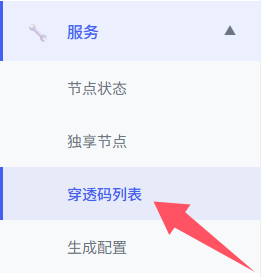
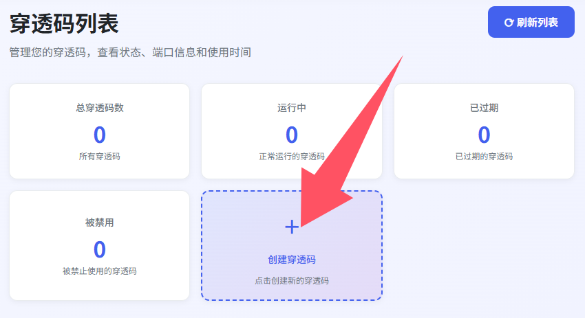
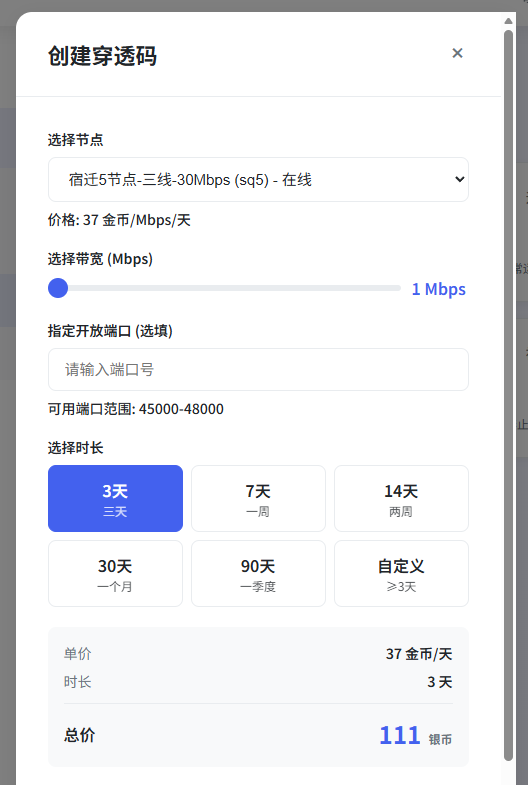
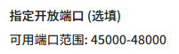
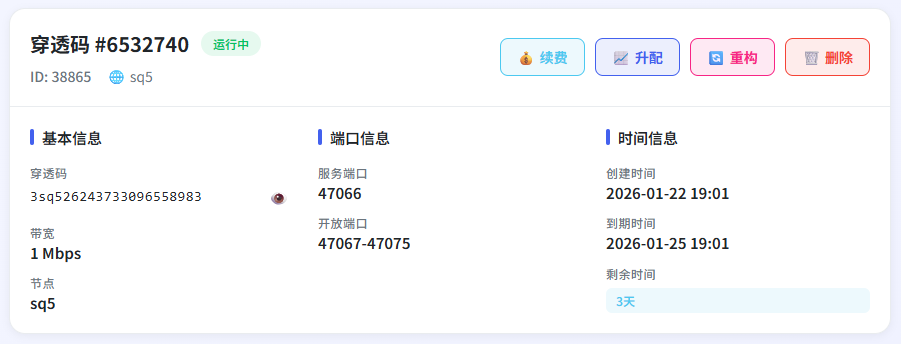

## 创建穿透码

点击左侧侧边栏 `服务` 选择 `穿透码列表`

> 假设现在我要创建一个 `sq5` 节点，带宽 `1mbps` ，日期 `3天` 的穿透码

!> 如果遇到 `指定开放端口` 没有输入框显示的情况（如下图）可以忽略或者f5刷新浏览器页面即可

点击 `创建穿透码` 屏幕右上角出现创建成功穿透码就创建好了喵

## 查看穿透码

|显示名称|解释|备注|
| :----: | :----: | :----: |
|续费|让你的穿透码变得更加持久|至少续费 `1天`|
|升配|让你的穿透码变得更加有力量|至少增加 `1mbps`|
|重构|如果你的穿透码不慎泄露，使用 `重构` 功能可以生成新的穿透码|消耗 `100银币` |
|删除|让你的穿透码灰飞烟灭|返还` 未使用天数-1` x `节点单价` 数量银币|
|服务端口|连接到 `frps` 服务器的端口|这里就是在创建穿透码的时候自定义填写的端口|
|远程端口|你可以在节点上使用的端口|MoBoxFrp特有的多端口|

