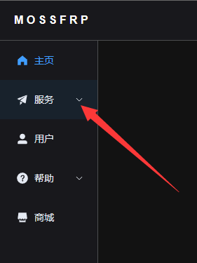
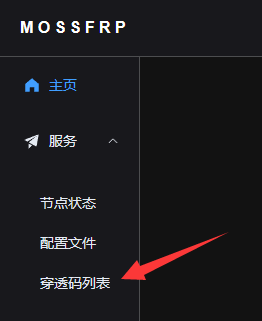
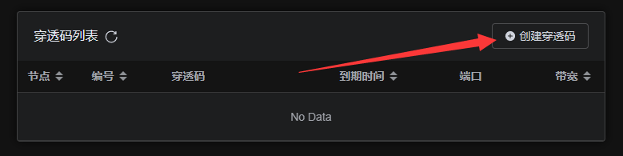
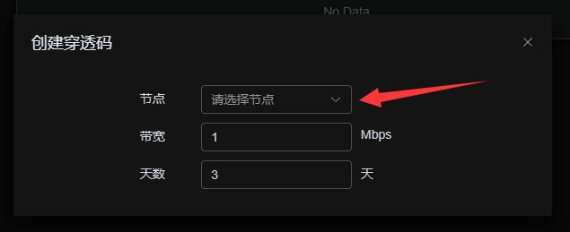
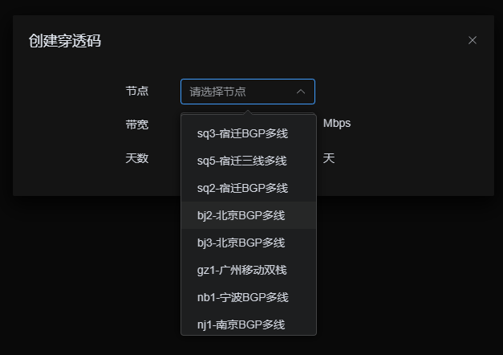
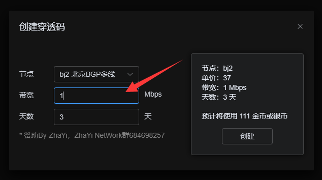
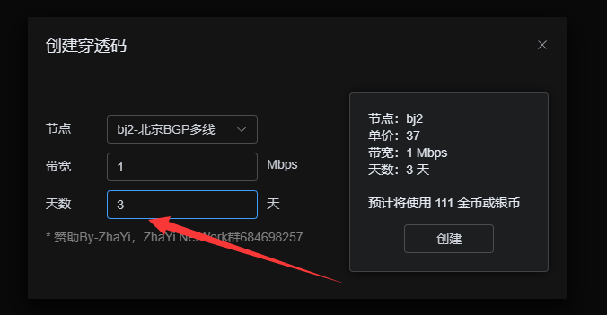
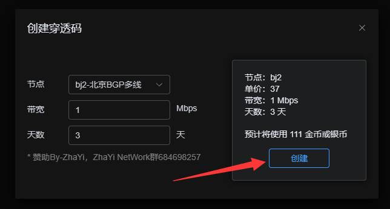
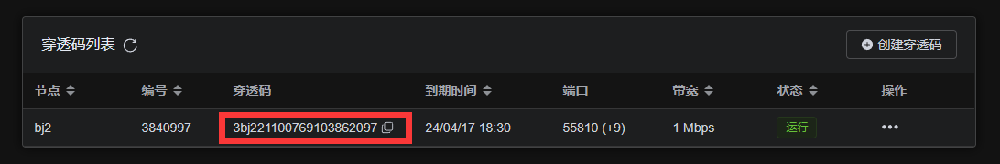

## 注册MossFrp账号

[快速注册MpssFrp账号](https://www.mossfrp.top/user/register)

## 创建一个穿透码

### 1.打开MossFrp管理面板

### 2.点击页面左侧服务

### 3.在展开列表中点击穿透码列表

- `节点状态` 实时展示MossFrp当前所有节点状态
- `配置文件` 生成穿透配置文件（一般情况下无需使用）

### 4.点击创建穿透码

### 5.点击箭头

### 6.在下拉菜单中选择节点（以bj2节点为例）

### 7.调整带宽大小

!> 带宽大小为理论带宽，实际因用户/节点网络情况略有波动

### 8.设置穿透码天数

> 天数最小为三天，最大360天

### 9.点击创建

### 10.出现“穿透码已创建”则为成功

### 11.复制你的穿透码

!> 如果找不到已经创建的穿透码，可以尝试手动刷新页面

## 计费方式

> 我们以 Mbps/1天 为单位
> 货币：1RMB=1000金币=1000银币
> 在银币足够时优先减少银币

举个栗子：bj2节点单价为 “37金币或银币/Mbps/天” 我想要购买bj2节点 5Mbps带宽 10天 
那么价格就是37（单价）×5（带宽）×10（天数）=1850金币或银币

