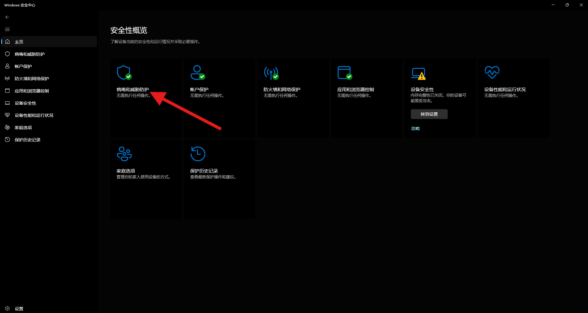
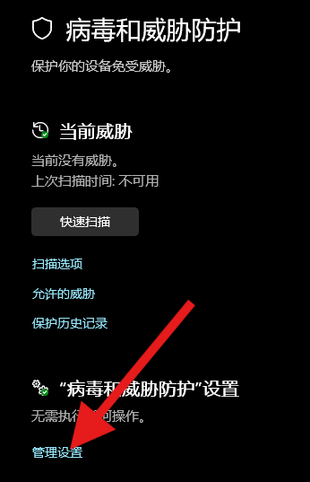
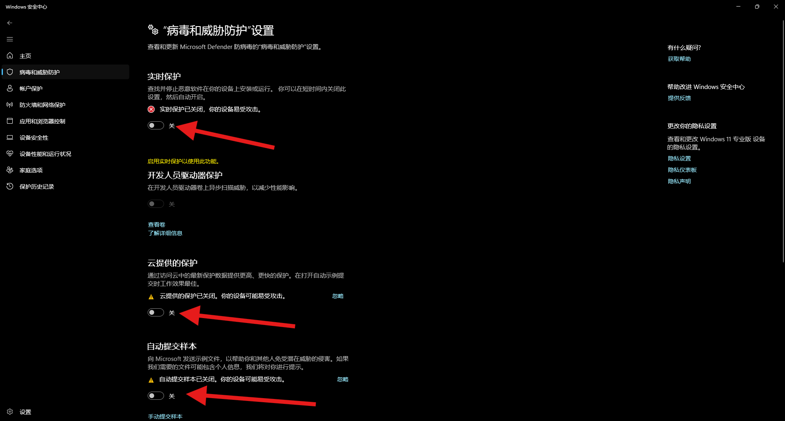

## 'frpc.exe' 不是内部或外部命令，也不是可运行的程序或批处理文件。

> 这种问题一般只会在Windows系统版本为10/11 或者 安装了除「火绒」以外的杀毒软件时出现

### Windows 11解决办法

#### 1.任务栏中点击搜索框，输入 "Windows 安全中心" ，注意空格

#### 2.点击打开

#### 3.点击病毒和威胁防护

> 出现“XX软件正在防护”请先将该软件退出再进行后续操作

#### 4.在 “病毒和威胁防护”设置 下点击 管理设置

#### 5.将箭头所指的所有开关关闭成灰色

#### 6.重新运行Mossfrp_Client

## 系统无法执行指定的程序。

详见[出现'frpc.exe' 不是内部或外部命令，也不是可运行的程序或批处理文件。](log.md)  

## 检测到潜在的病毒或恶意软件

详见[出现'frpc.exe' 不是内部或外部命令，也不是可运行的程序或批处理文件。](log.md)  

!> 以下绿色框中均以`bj2`节点，隧道名称为`zhayi`的隧道作为示例

## `[XXX]` start proxy success
名称为 `XXX` 的隧道启动成功，一切正常 

## recover success: [`XXX`]
重连成功: [`XXX`]，正常网络波动，10 分钟内不超过 1 次可忽略 

## recover to server timed out
重连失败，可能网络波动造成，frpc 会自动尝试另外一种重连方式，一般可以忽略

## Connection recover failed: `XXX` 
重连失败: `XXX`，可能网络波动造成，frpc 会自动尝试另外一种重连方式，一般可以忽略

## read from control connection EOF
控制连接读取失败EOF，可能是网络不稳定

## write message to control connection error: `XXX`
控制连接写入失败: `XXX`，可能是网络不稳定

## login to server failed: `XXX`
登录节点失败: `XXX`，请检查网络连接，你可以在cmd中使用 ping <mossfrp节点号>.mossfrp.cn（例如 bj2.mossfrp.cn nb1.mossfrp.cn）测试节点连通性，也可以检查穿透码是否到期

## connect to local service [`XXX`] error: `YYY`
连接映射目标 [`XXX`] 失败: `YYY`，检查你的本地服务是否打开并运行在正确的IP地址、端口上

## 程序运行时所有字符显示为"?"

请检查你的系统语言设置是否第一语言为中文，地区设置是否为中国

