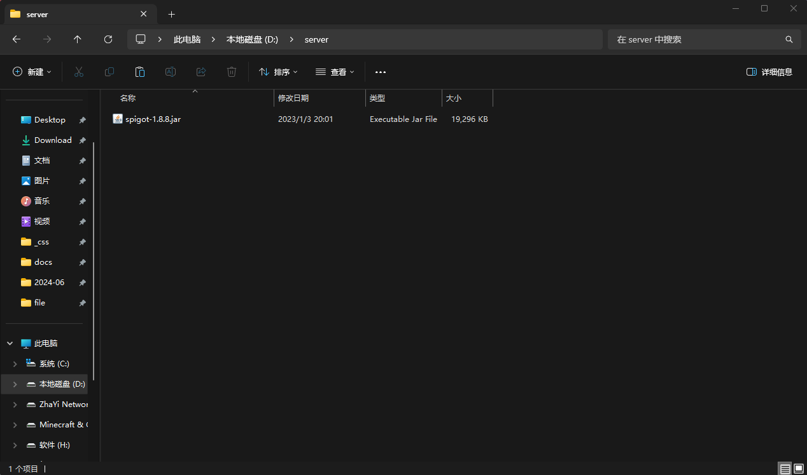
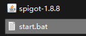
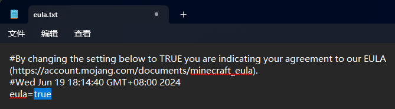
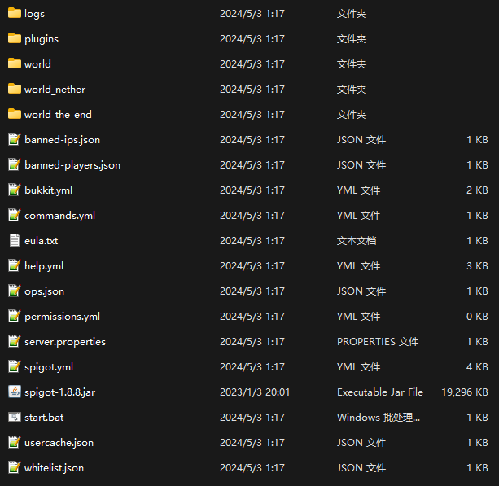

## 下载服务端

### 选择合适的服务器核心

<!-- tabs:start -->

#### **Vanilla**

`优点`：官方出品，绝对稳定，占用较小

`缺点`：无法使用插件、mod；局限性大

#### **Spigot**

> 低版本（1.8-）开服必选

`优点`：可以使用插件，相对于 `官方服（Vanilla）` 有一定优化

`缺点`：可能会有大大小小的错误；报错信息很迷（？

#### **PaperSpigot**

> 高版本（1.12+）开服必选，简称 `Paper` 

`优点`：可以使用插件，比 `Spigot` 相对稳定

`缺点`：有一些特性在 `Spigot` 和 `单人游戏` 中可以实现，但是无法在 `PaperSpigot` 中实现；消耗资源较大 

#### **Mohist**

> `Forge` 服务器首选

`优点`：可以安装ForgeMod，几乎全版本

`缺点`：需要较高的内存启动服务器，（引用群u的一句话：高版本就是报错模拟器）

遇到问题可以去 [Mohist Discord](#) 反馈
 
<!-- tabs:end -->

### 将下载到的核心文件单独创建一个文件夹放好（以Spigot-1.8.8为例）



### 在文件夹下新建 `start.bat` 并用 `记事本` 打开

#### 如果你创建完长这样：

##### Windows11下勾选 `查看` → `显示` 中的 `文件扩展名` 


##### Windows10下勾选 `查看` 中的 `文件扩展名` 

##### Windows7下相对复杂

在 `文件资源管理器` 左上角的 `组织` 中打开 `文件夹和搜索选项` ，在弹出的窗口内点击 `查看` 选项卡，往下滑取消勾选 `隐藏已知文件类型的扩展名` 


#### 向内粘贴以下代码

```bat
@echo OFF
java -Xms<最小内存>M -Xmx<最大内存>M -jar <核心名字>.jar
pause
```

| 代码块部分 | 影响 | 是否可不填 | 例子 |
| :----: | :----: | :----: | :----: |
| `@echo OFF` | / | 必填 | / |
| `title <窗口标题>` | 你在运行bat文件后出现的黑框的窗口标题 | 可不填 | `title Genshin Impact, Launch!` |
| `java` | 默认填写 `java` 若出现找不到路径，请手动填写系统中 `java.exe` 的位置 | 必填 | `"C:\Program Files\Java\jdk-17\bin\java.exe"` |
| `-Xms<最小内存>M` | 服务器运行时占用的最小内存，`1024` 可改，注意 `M` 必须为大写，否则报错，不填写则为自动分配 | 可不填 | `-Xms1024M` |
| `-Xmx<最大内存>M` | 服务器运行时占用的最小内存，`2048` 可改，注意 `M` 必须为大写，否则报错，不填写则为自动分配 | 可不填| `-Xmx2048M` |
| `-jar` | / | 必填 | / |
| `<核心名称>.jar` | 你下载的服务器核心名称，若更改过，请同步更改 | 必填 | `Spigot-1.8.8.jar` |
| `pause` | 在程序退出后出现 `请按任意键继续` ，若服务器出现报错，可保留控制台窗口查错，不用翻log（日志）文件 | 建议填写 | / |

以下是一个示例：

```bat
@echo OFF
title Genshin Impact, Launch!
java -Xms1024M -Xmx2048M -jar spigot-1.8.8.jar
pause
```

#### 填写完成后保存bat文件

## 启动服务端

### 运行 `start.bat`

#### 出现 `Loading libraries, please wait...` 代表bat文件配置没有问题

#### 同意 `EULA` 

当控制台出现以下日志：

```log
Loading libraries, please wait...
[11:45:14 INFO]: Starting minecraft server version 1.8.8
[11:45:14 INFO]: Loading properties
[11:45:14 WARN]: server.properties does not exist
[11:45:14 INFO]: Generating new properties file
[11:45:14 WARN]: Failed to load eula.txt
[11:45:14 INFO]: You need to agree to the EULA in order to run the server. Go to eula.txt for more info.
[11:45:14 INFO]: Stopping server
```

同意 `EULA` 可以理解为你在别的网站或应用登录需要勾选“我已同意《用户许可协议》”，关闭控制台，回到服务器文件目录，打开 `eula.txt` ，将最后一行的 `eula=false` 改为 `eula=true` 保存更改并重新运行服务器



#### 当你在控制台看到 `Done (x.xxxs)!` 时，服务器启动成功

PS:服务器完整文件如下图



## 配置 `server.properties`（还是以1.8.8为例子，所有版本都差不多）

更详细的可以去看[Minecraft Wiki](https://minecraft.fandom.com/zh/wiki/Server.properties)，此处只列举常用的项

| 名称 | 默认 | 影响 |
| :----: | :----: | :----: |
| `view-distance` | `view-distance=10` | 玩家进入到服务器可以看到的最大区块距离（视距），过大会导致服务器卡顿，~太小玩家就瞎了（~，2b2t该项为4（也许） |
| `server-ip` | `server-ip=` | 服务器运行IP，一般不需要填写 |
| `level-seed` | `level-seed=` | 服务器地图种子，留空则随机 |
| `gamemode` | `gamemode=0` | 玩家第一次进入服务器时默认的游戏模式，0为生存模式，1为创造模式 |
| `server-port` | `server-port=25565` | 服务器运行的端口，冲突需更换 |
| `enable-command-block` | `enable-command-block=false` | 是否启用命令方块， `false` 为禁用， `true` 为启用 |
| `motd` | `motd=A Minecraft Server` | 在多人游戏内现实的服务器信息， `=` 后内容可随意填写 |
| `white-list` | `white-list=false` | 启用玩家白名单，详见 [Minecraft Wiki](https://minecraft.fandom.com/wiki/Whitelist.json) |
| `max-players` | `max-players=20` | 服务器允许的最大人数 |
| `online-mode` | `online-mode=true` | 是否为离线服务器，如果你想要离线玩家进入服务器，请将 `true` 改为 `false` |


